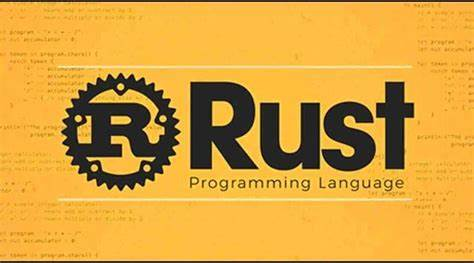

# RustForge




RustForge is a powerful and flexible framework designed to streamline application development in Rust. It provides core functionalities, routing, data access, templating, and more, enabling developers to build robust applications quickly and efficiently.

## Features

- **Modular Architecture**: Built with modular components for easy extension and maintenance.
- **Routing**: Simple and effective routing mechanism for handling HTTP requests.
- **Data Access Layer**: Abstracts database interactions, making it easy to manage data.
- **Templating Engine**: Provides tools for rendering dynamic content.
- **Logging**: Integrated logging for monitoring application behavior.
- **Testing Utilities**: Built-in support for unit and integration testing.

## Installation

To use RustForge in your Rust project, add it as a dependency in your `Cargo.toml` file:

```toml
[dependencies]
rustforge = { git = "https://github.com/Sanidhyafeaturist/RustForge.git" }
```
## Getting Started

### Creating a New Project

1. Create a new Cargo project:
   - Run `cargo new my_app`
   - Change to the project directory with `cd my_app`

2. Add RustForge to your `Cargo.toml`:
   - Include the dependency as shown above.

### Basic Usage Example

Here’s a simple example of how to set up a basic application using RustForge:

- Initialize the configuration for your app.
- Set up the router to handle routes.
- Define a sample route for handling requests.

### Running the Application

To run your application, use the command:

```bash
cargo run
```
### Testing

To run tests for your application, use:

```bash
cargo test
```
## Contributing

Contributions are welcome! Please follow these steps:

1. Fork the repository.
2. Create a new branch for your feature or bug fix.
3. Make your changes and commit them.
4. Submit a pull request for review.

## Community

Join the RustForge community for support, discussions, and sharing your projects. Feel free to ask questions and share your experiences!

## License

This project is licensed under the MIT License. See the `LICENSE` file for details.


